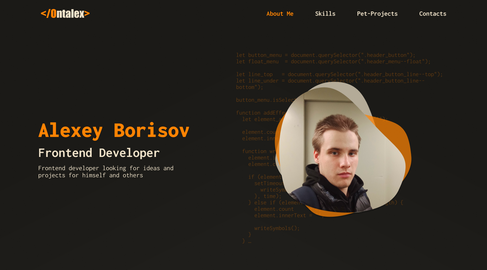
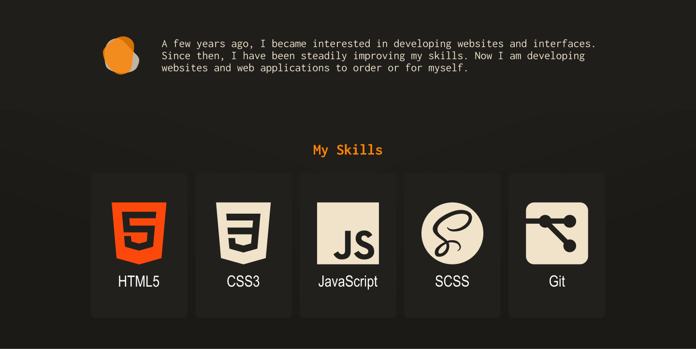
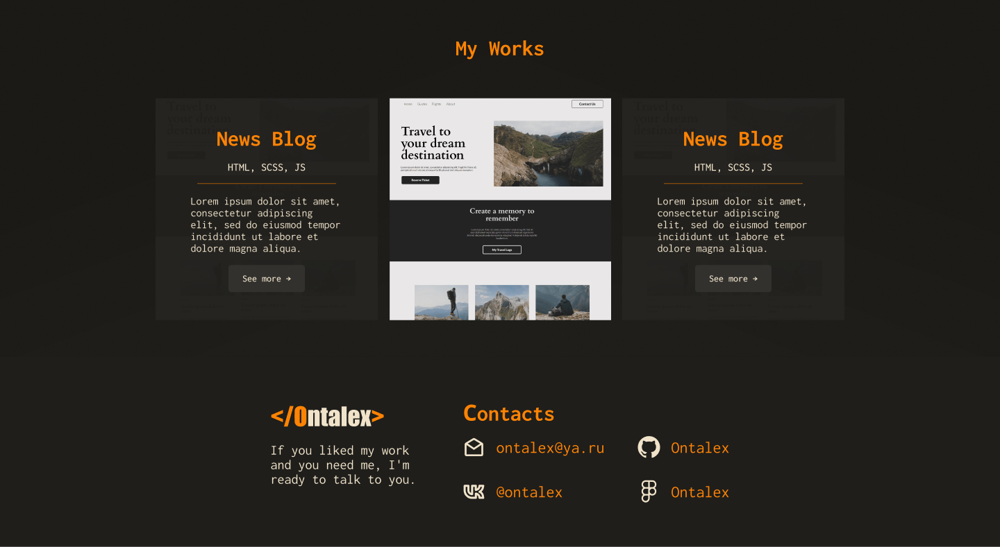

# Portfolio

Set up the project, the goal here is to master all of the tools and best practices of Linter, Gitflow and use HTML, CSS and JavaScript to create my portfolio based on the design [Figma](https://www.figma.com/file/37I8ZWolwztoarMD9FXlbI/My-Portfolio-(Community)?node-id=3-12&t=8W33z4xTeJtBANZm-0)

## Built With

- HTML
- CSS
- JavaScript

### Prerequisites
- GIT 

### Setup
- Clone this [Repository](https://github.com/danyhoshi/portfolioproject) in order to get a copy of this project
- From develop branch, open the index.html file with your browser.

## Author

- GitHub: [@danyhoshi](https://github.com/danyhoshi)
- LinkedIn: [@LinkedIn](https://www.linkedin.com/in/daniela-gonz%C3%A1lez-ba16a556/)
- Twitter: [@dany_hoshi](https://twitter.com/Dany_hoshi)

## Contributing

Contributions, issues, and feature requests are welcome!

Feel free to check the [issues page](../../issues/).

## Show your support

Give a ⭐️ if you like this project!

## Acknowledgments

- The owner of the base design. 
- Our Studying group.

## 📝 License

This project is [MIT](./MIT.md) licensed.
